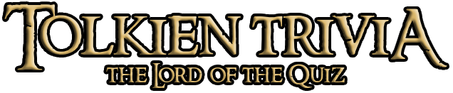

# Tolkien Trivia 
 'Tolkien Trivia' is a quiz website that's questions are focused on the mythos and lore of J.R.R. Tolkien's Middle Earth.

The site is a fun, interactive experience, that is very easy to navigate through. It consists of three pages, the 'Welcome' page, the 'Quiz' page, and a 'Bonus Prize' page at the end of the quiz.

## Inception and Initial Design

I wanted the aesthetic of the website to match that of 'The Lord of the Rings' move franchise. I began by creating a mock-up design using Balsamiq Wireframes. I am very happy with the final result, as the original mockup  translated very well onto the final project. 

 I created the quiz's logo by downloading the 'Ringbearer' font from [dafont.com](https://www.dafont.com/ringbearer.font). This font is a based off of the original font used in the trilogy's movie posters. I formatted the logo in Adobe Photoshop, where I embossed and added an outline and shadow to  the final logo. 

 Original logo.

 

 Final logo, editied through Adobe Photoshop.

 

 ## Final Layout

* Home Page

* Quiz Page

* Final Score Page

* Bonus Page

## Features

### Interactive Home Page
* The Home Page welcomes the user to the quiz site. 
* It features an Icon tag that loads the href to the quizgame.html page.
* The tag is styled using a ring icon, similar in appearance to the One Ring from the books and films. 
* The icon was taken from [fontawesome.com](https://fontawesome.com/icons).
* I was able to animate the icon on fontawesome.com, to make it fade in and out of opacity and pulsate, which is an ode to the mystical nature of the One Ring. 

### Background Image

* The background image was taken from [wallpaperaccess.com](https://wallpaperaccess.com/red-leather), a site where you can download royalty-free background images. I wanted to go for a cracked red leather background, similar in style to Bilbo's Journal.
* The orignal background that I found was too bright and garish. I loaded the background into Adobe Photoshop and toned it down, using the burn tool. 

Orginal Background 

Edited Final Background 

### Quiz Game

* When the user clicks on the One Ring icon on the home screen, the quizgame.html page is loaded. 
* The quiz consists of 20 questions that randomise at each refresh, to avoid monotony. 
* The questions have four answer variables, that change colour, depending on if they are correct or incorrect.
* The questions sit in a box div that is stylized with a black background and gold border. 
* The 'Next' button appears, through Javascript, everytime an answer is selected. 

Javascript Examples

### Score Page

* When all 20 questions are answered, the quizgame page changes to a new layout.
* Using javascript, the h1 element that housed the questions, now displays the final score. 
* The div now also contains two buttons, the first of which loads the 'Bonus page,' whilst the second of which, restarts the game. 

### Bonus Page 

* I wanted to inlude an easter egg to the phenomenon of memes, referencing 'The Lord of the Rings' films, since their release over 20 years ago. 
* I picked one of the most famous memes assoicated with 'The Lord of the Rings,' being the ['Gandalf Sax Guy'](https://www.youtube.com/watch?v=G1IbRujko-A) video, which was made famous by the parody YouTube page, ['Teh Lurd of Teh Reings.'](https://www.youtube.com/channel/UCYXpatz5Z4ek0M_5VR-Qt1A)
* I embeded a gif of the video from [giphy.com](https://giphy.com/gifs/reaction-laughing-lotr-TcdpZwYDPlWXC), and set is as the background image for the Bonus Page. 

## Colour Scheme and Design 

Given that the quiz is based around 'rings,' I wanted to inlude a golden colour somewhere in the website. 'Goldenrod' was the natural choice. I wanted the 'correct' and 'incorrect' button colours to not be generic shades of green and red. I picked their colours using an eyeddropper tool. 

The correct colour was picked from the green background of the sigil of Rohan.

The incorrect colour was picked from the red text colour of the Middle Earth Map logo.

The background colour of the answer buttons, was picked from the map of Middle Earth. 

I have created a colour pallete for the colours used on the site, using [coolors.com](https://coolors.com).

## Fonts 

As mentioned previously, I created the quiz's logo using dafont.com. I chose two fonts for the body. "Instrument Serif' resembled the font used on the old book covers of the trilogy. This font was embeded through ['Google Fonts'](https://fonts.google.com/). I also chose the 'Labo' font, as I believe that it compliments the 'Instrument" font. 

## Testing

I tested my site on Chrome, Safari and Firefox. The site ran smootly on all browsers. 

The background audio autoplayed on all browsers, however, users will have to check that they have autoplay enabled on Safari and Firefox.

The site appeared clear, was easy to use and was legible on all screen sizes. 

The questions ran smootly without any bugs or glitches. 

### Validation 

There were only a couple of parse errors when testing the HTML, Javascript and CSS validation, with the W3Schools validator, along with codebeautifully.org. These were fixed upon validation. 

I also tested the performance of the website on Google Lighthouse, on Dev-tools. Below is my site's score.

## Unresolved Bugs

There were no unresolved bugs. 

## Deployment 

The site was successfully deployed to Github pages, using the following steps.
* Navigate to "Settings" in the github repository. 
* Scroll down to 'Pages.'
* Select "Deploy from Branch.'
* Select '/root.'
* Click 'Save.'
* A website link should appear at the top of the refreshed page. 

Here's the link to my site - [Tolkien Trivia](https://cathalsweeney6.github.io/tolkientrivia/).

## Credits 

* The quiz layout was inspired by the following [YouTube tutorial](https://www.youtube.com/watch?v=PBcqGxrr9g8), which I followed when creating the site.
* The background music was added and coded, by following a tutorial on HTML audio on [w3schools.com](https://www.w3schools.com/html/html5_audio.asp).
* The background music on the home page is royalty free music taken from this [YouTube Link]().
* The background music on the quiz page is royalty free music taken from this [YouTube Link]().
* The background music on the bonus page was taken from [voicemod.net](https://tuna.voicemod.net/sound/1efd65cc-7930-4b19-880b-b605458db7a9).
* The logo was created using [dafont.com](https://www.dafont.com/ringbearer.font).
* The 'One Ring' icon was taken from [fontawesome.com](https://fontawesome.com).
* the gif on the 'Bonus page,' was taken from [giphy.com](https://giphy.com/gifs/reaction-laughing-lotr-TcdpZwYDPlWXC).
* All fonts, along with their variations and styles on this site, were priorly tested on [Google Fonts](https://fonts.google.com/).